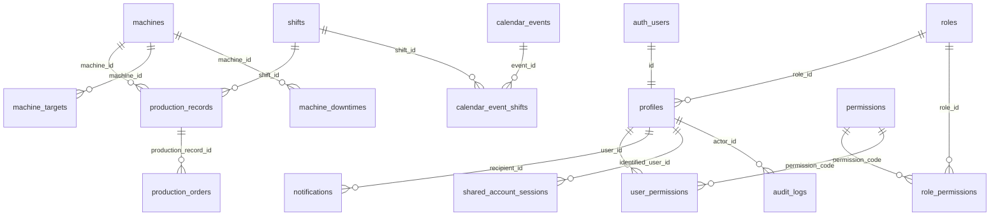

# Referência Técnica do Schema

> Versão do schema: `v0.27.0` · Última atualização: 05/10/2026 · Status: **implementado no Supabase**, no projeto que virou o de produção (D55), com o histórico da planilha já carregado. A interface oficial é a de `prototype/` (D56). O sistema em uso na fábrica continua sendo o Google Sheets até a virada.
> SGBD: PostgreSQL (Supabase) · Schema: `public` (+ `auth`, gerenciado pelo Supabase)
> Decisões citadas como `[Dxx]` estão em [03-decisoes.md](03-decisoes.md).

## 1. Convenções

| Item | Regra |
|---|---|
| Identificadores | inglês, `snake_case`, sem acentos |
| Tabelas | plural (`machines`) |
| Chave estrangeira | `<entidade_singular>_id` (`machine_id`) |
| Timestamps | `timestamptz`, sufixo `_at`, preenchidos por `default now()` / trigger |
| Datas puras | `date`, sem sufixo de tempo; exibição `dd/mm/aaaa` é responsabilidade do frontend |
| Domínios fechados | `text` + `CHECK (col IN (...))`, sem `ENUM` (portabilidade e evolução) |
| Autoria | `created_by` / `updated_by` → `profiles(id)` |
| Chaves primárias | `uuid default gen_random_uuid()` para dados; `smallint`/`integer identity` para catálogos; `bigint identity` para log |
| Fuso de negócio | `America/Sao_Paulo` em toda regra que dependa de "hoje" (o servidor roda em UTC) |

## 2. Diagrama ER

Colunas de autoria (`created_by`, `updated_by`, `granted_by`, `approved_by`) → `profiles` omitidas do diagrama.

## 3. Dicionário de dados

Legenda: **PK** chave primária · **FK** chave estrangeira · **NN** not null · **UQ** unique.

### 3.1 `machines` ✅ implementada em 20/09/2026
| Coluna | Tipo | Restrições | Descrição |
|---|---|---|---|
| `id` | `integer` | PK, `generated always as identity` | [D01] |
| `name` | `text` | NN, CHECK não vazio; UQ em `lower(name)` (`machines_name_lower_key`) | [D02] |
| `has_target` | `boolean` | NN, default `true` | Participa do cálculo de meta |
| `status` | `text` | NN, default `'active'`, CHECK `active`/`inactive`/`maintenance`/`preventive_maintenance`/`planned` | `planned` = prevista, ainda não existe na fábrica [D05, D41] |
| `status_updated_at` | `timestamptz` | | Última mudança de status (gatilho `set_machine_status_updated_at`) |
| `standard_operator_count` | `smallint` | CHECK `>= 0` | Lotação padrão [D12] |
| `process` | `text` | CHECK `assembly`/`packaging` | Processo do centro de trabalho. Nulo nas 18 máquinas antigas até a parte 2 [D37] |
| `pieces_per_minute` | `numeric(10,3)` | CHECK `> 0` | Da planilha de capacidade. Só alarme de meta impossível, nunca cálculo da meta [D40] |
| `efficiency` | `numeric(4,3)` | CHECK `> 0 e <= 1` | Eficiência esperada (a fábrica usa 0,60 a 0,90) [D40] |
| `started_on` | `date` | | Entrada em operação; turnos anteriores não são cobrados [D41, D35] |
| `created_by`, `updated_by` | `uuid` | FK `profiles`; `created_by` default `auth.uid()` | [D04] |
| `created_at`, `updated_at` | `timestamptz` | NN, default `now()` | |

Exclusão física bloqueada por FK quando houver produção; desativar via `status`. Gatilhos: `set_updated_at`, `set_machine_status_updated_at`. `id` só aceita valor manual com `OVERRIDING SYSTEM VALUE` (usado no seed para manter os ids do legado).

### 3.2 `shifts` ✅ implementada em 16/09/2026 (reaplicada no projeto atual em 20/09/2026 — D28)
| Coluna | Tipo | Restrições | Descrição |
|---|---|---|---|
| `id` | `smallint` | PK | 1, 2, 3 |
| `name` | `text` | NN, UQ, CHECK não vazio | "TURNO 1" |
| `start_time`, `end_time` | `time` | | Turno 3 atravessa a meia-noite (`end_time < start_time`) |
| `gross_minutes` | `smallint` | CHECK `> 0` | Duração bruta segundo a planilha de capacidade. Informativo |
| `useful_minutes` | `smallint` | CHECK `> 0`; CHECK de tabela `shifts_useful_within_gross` (`useful <= gross`) | Minutos que realmente produzem. T1 493, T2 481, T3 271 [D42] |
| `is_active` | `boolean` | NN, default `true` | Substitui `localStorage.turnosAtivos` [D06] |

> **Regra: `start_time`/`end_time` são descritivos.** O turno de um apontamento vem SEMPRE do `shift_id` escolhido por quem aponta, nunca do relógio. Apontadores costumam trabalhar além do horário do turno (passagem de turno, organização interna), então inferir o turno pelo horário produziria dado errado. `created_at` registra *quando* o apontamento foi feito; `shift_id` registra *a que turno* a produção pertence. [D06]

### 3.3 `production_records` ✅ implementada em 20/09/2026
| Coluna | Tipo | Restrições | Descrição |
|---|---|---|---|
| `id` | `uuid` | PK | |
| `production_date` | `date` | NN | |
| `shift_id` | `smallint` | NN, FK `shifts` | |
| `machine_id` | `integer` | NN, FK `machines` | |
| `target_quantity` | `integer` | NN, CHECK `>= 0` | Snapshot da meta vigente [D08] |
| `target_basis` | `text` | NN, default `'per_shift'`, CHECK `per_shift`/`per_shift_prorated`/`per_operator` | Snapshot da **base** da meta: como ler `target_quantity` (fixa, rateada pela lotação, ou de cada pessoa) [D39, D46, D47] |
| `operator_count` | `smallint` | CHECK `>= 0` | [D12] |
| `work_mode` | `text` | NN, default `'regular'`, CHECK `regular`/`overtime` | Hora extra não entra no cálculo de meta [D27] |
| `notes` | `text` | CHECK até 500 caracteres | |
| `created_by`, `updated_by` | `uuid` | FK `profiles`; `created_by` default `auth.uid()` | |
| `created_at`, `updated_at` | `timestamptz` | NN, default `now()` | |
| `import_batch_id` | `uuid` | FK `import_batches` | Lote que criou o apontamento. **Nulo = apontado por uma pessoa** [D35] |
| `source_ref` | `text` | | Origem na planilha, ex.: `JUN 26!F12` [D35] |

- UQ `production_records_unique_entry (machine_id, production_date, shift_id, work_mode)` [D10, D27]
- Índices: `(production_date)`, `(shift_id)`, `(created_by)` e o parcial `(import_batch_id) where import_batch_id is not null`, que só cobre o que veio de importação. A busca por `(machine_id, production_date)` usa o índice da UQ (mesmo prefixo), por isso não há índice separado. Gatilho `set_updated_at`.
- `UPDATE`/`DELETE` diretos negados por RLS; somente via funções (seção 6).

### 3.4 `production_orders` ✅ implementada em 20/09/2026
| Coluna | Tipo | Restrições | Descrição |
|---|---|---|---|
| `id` | `uuid` | PK | |
| `production_record_id` | `uuid` | NN, FK `production_records` `ON DELETE CASCADE` | |
| `order_number` | `text` | NN | Texto: preserva zeros à esquerda (SAP). Desde a 0.22.0, o app só grava **de 1 a 15 dígitos** (D57); o histórico importado é `IMPORTADO` |
| `quantity` | `integer` | NN, CHECK `> 0` | |
| `is_rework` | `boolean` | NN, default `false` | |
| `notes` | `text` | | |
| `created_at` | `timestamptz` | NN, default `now()` | |

Índices: `(production_record_id)`, `(order_number)`. [D09]

### 3.4b `work_orders` (migration 0036) [D62]
| Coluna | Tipo | Restrições | Descrição |
|---|---|---|---|
| `id` | `uuid` | PK | |
| `order_number` | `text` | NN, UNIQUE, CHECK só números, 1 a 15 | Chave natural: liga a OP ao apontamento (`production_orders.order_number`) e é por ela que a carga do SAP reconhece a OP |
| `machine_id` | `integer` | NN, FK `machines` | |
| `material_code` | `text` | CHECK só números, até 18 | O material pertence à OP, não ao apontamento |
| `material_description` | `text` | | |
| `planned_quantity` | `integer` | CHECK `> 0` | Quantidade pedida |
| `stage` | `text` | NN, default `waiting`, CHECK | `pending_review` (a conferir), `waiting`, `running`, `paused`, `done` |
| `pause_reason` | `text` | CHECK: preenchido se e só se `paused` | |
| `released_at`, `closed_at` | `timestamptz` | | Liberação e conclusão |
| `source` | `text` | NN, default `app`, CHECK | `app`, `apontamento` (nasceu de um número novo) ou `sap` |
| `sap_synced_at` | `timestamptz` | | Última carga do SAP |
| `created_by`, `created_at`, `updated_by`, `updated_at` | | | Auditoria |

Sem chave estrangeira para `production_orders`: o histórico tem `IMPORTADO`,
que não é OP. RLS: lê quem aponta (`production.create`) ou vê feedbacks.
Escrita só pelas funções.

### 3.4c `work_order_messages` e `work_order_reads` (migration 0036) [D62]
`work_order_messages`: `id`, `work_order_id` (FK, `ON DELETE CASCADE`),
`author_id` (nulo = mensagem do sistema), `body`, `created_at`. Lê quem tem
`feedbacks.view`. O operador não escreve aqui: a observação dele aparece pela
view `work_order_conversation`.

`work_order_reads`: (`user_id`, `work_order_id`) PK, `last_read_at`. Cada pessoa
só lê a própria linha.

### 3.5 `machine_downtimes` ✅ implementada em 20/09/2026 *(sem uso — integração SFM futura)*
| Coluna | Tipo | Restrições | Descrição |
|---|---|---|---|
| `id` | `uuid` | PK | |
| `machine_id` | `integer` | NN, FK `machines` | |
| `reason` | `text` | NN, CHECK `maintenance`/`preventive_maintenance` | |
| `started_at` | `timestamptz` | NN | |
| `ended_at` | `timestamptz` | CHECK `machine_downtimes_period_check`: `ended_at > started_at` | Nulo = em andamento |
| `source` | `text` | NN, default `'manual'`, CHECK `manual`/`sfm` | |
| `external_id` | `text` | | ID no sistema de origem |
| `notes` | `text` | | |
| `created_by` | `uuid` | FK `profiles`, default `auth.uid()` | |
| `created_at` | `timestamptz` | NN, default `now()` | |

UQ `machine_downtimes_source_external_id_key (source, external_id)` (idempotência de importação) · Índice `(machine_id, started_at)`. [D05]

### 3.6 `machine_targets` ✅ implementada em 20/09/2026
| Coluna | Tipo | Restrições | Descrição |
|---|---|---|---|
| `id` | `uuid` | PK | |
| `machine_id` | `integer` | NN, FK `machines` | |
| `quantity_per_shift` | `integer` | NN, CHECK `>= 0` | Igual para todos os turnos [D14] |
| `basis` | `text` | NN, default `'per_shift'`, CHECK `per_shift`/`per_shift_prorated`/`per_operator` | Como ler `quantity_per_shift`: meta do turno, meta do turno rateada pela lotação, ou meta de cada pessoa [D39, D47] |
| `valid_from` | `date` | NN; gatilho recusa data < hoje (SP) em INSERT e UPDATE | [D15] |
| `created_by` | `uuid` | FK `profiles`, default `auth.uid()` | |
| `created_at` | `timestamptz` | NN, default `now()` | |

UQ `machine_targets_machine_valid_from_key (machine_id, valid_from)` — também atende a busca "maior `valid_from` ≤ data". Append-only para o passado: metas já vigentes antes de hoje não podem ser alteradas; a meta de hoje/futura pode ser corrigida pela função `save_machine_targets` [D13, D31].

### 3.7 `calendar_events` ✅ implementada em 20/09/2026
| Coluna | Tipo | Restrições | Descrição |
|---|---|---|---|
| `id` | `uuid` | PK | |
| `event_date` | `date` | NN | |
| `description` | `text` | NN, CHECK não vazio | |
| `event_type` | `text` | NN, CHECK `holiday`/`special_event`/`excluded_day` | [D16] |
| `scope` | `text` | NN, CHECK `national`/`state`/`municipal`/`company` | |
| `source` | `text` | NN, default `'manual'`, CHECK `manual`/`brasil_api` | |
| `created_by` | `uuid` | FK `profiles`, default `auth.uid()` | Nulo quando importado |
| `created_at` | `timestamptz` | NN, default `now()` | |

Índice `(event_date)` · UQ parcial `calendar_events_brasil_api_date_key (event_date) WHERE source = 'brasil_api'` [D17, D18]. A rotina de importação (Edge Function + Cron) ainda não existe.

### 3.8 `calendar_event_shifts` ✅ implementada em 20/09/2026
| Coluna | Tipo | Restrições |
|---|---|---|
| `event_id` | `uuid` | FK `calendar_events` `ON DELETE CASCADE` |
| `shift_id` | `smallint` | FK `shifts` |

PK `(event_id, shift_id)` · Índice `(shift_id)`. Sem linhas = evento vale para todos os turnos. [D17]

### 3.9 `profiles` ✅ implementada em 20/09/2026
| Coluna | Tipo | Restrições | Descrição |
|---|---|---|---|
| `id` | `uuid` | PK, FK `auth.users(id)` `ON DELETE CASCADE` | |
| `full_name` | `text` | NN, CHECK não vazio | Não único |
| `badge_number` | `text` | UQ, CHECK não vazio | Nº de cadastro do crachá [D21] |
| `account_type` | `text` | NN, default `'personal'`, CHECK `personal`/`shared`/`display` | |
| `status` | `text` | NN, default `'pending'`, CHECK `pending`/`active`/`blocked` | [D20] |
| `role_id` | `smallint` | FK `roles` | Perfil-modelo aplicado |
| `approved_by` | `uuid` | FK `profiles` | |
| `approved_at` | `timestamptz` | | |
| `created_at`, `updated_at` | `timestamptz` | NN, default `now()` | |

CHECK `profiles_personal_requires_badge`: `account_type <> 'personal' OR badge_number IS NOT NULL`. Índices: `(status)`, `(role_id)`. Gatilho `set_updated_at`.

> **Criação e remoção de contas [D29]:** o gatilho `handle_new_user` recusa cadastro pessoal sem crachá com mensagem em português. Contas `shared`/`display` são criadas enviando `account_type` nos metadados do cadastro. Usuários que já têm histórico (aprovaram alguém, apontaram produção, aparecem na auditoria) **não podem ser apagados** — as chaves estrangeiras impedem; a saída é `status = 'blocked'`.

### 3.9b `import_batches` (migration 0016)
| Coluna | Tipo | Restrições | Descrição |
|---|---|---|---|
| `id` | `uuid` | PK | |
| `source_file` | `text` | NN, CHECK não vazio | Nome do arquivo da planilha |
| `description` | `text` | | |
| `status` | `text` | NN, default `draft`, CHECK `draft`/`loaded`/`reverted`/`failed` | Unidade de carga e reversão |
| `loaded_at`, `reverted_at` | `timestamptz` | | |
| `error_message` | `text` | | Preenchido quando a carga falha |
| `created_by` | `uuid` | FK `profiles`, default `auth.uid()` | |
| `created_at` | `timestamptz` | NN, default `now()` | |

### 3.9c `import_rows` (migration 0016)
Área de preparo: uma linha por célula da planilha, com a **origem** e a **interpretação** lado a lado.

| Coluna | Tipo | Restrições | Descrição |
|---|---|---|---|
| `id` | `bigint` | PK, identity | |
| `batch_id` | `uuid` | NN, FK `import_batches` ON DELETE CASCADE | Apagar o lote leva as linhas |
| `source_sheet`, `source_cell` | `text` | NN; UQ `(batch_id, source_sheet, source_cell)` | Origem exata; a UQ impede contar a mesma célula duas vezes |
| `raw_machine`, `raw_value` | `text` | `raw_machine` NN | O que a planilha dizia, sem interpretação |
| `kind` | `text` | NN, CHECK `production`/`rework`/`downtime`/`note`/`discard` | No que a célula vira |
| `machine_id`, `production_date`, `shift_id`, `work_mode`, `quantity`, `operator_count`, `notes` | | CHECK de tabela `import_rows_producao_completa` | Produção e retrabalho exigem máquina, data, turno, quantidade e modo |
| `discard_reason` | `text` | CHECK de tabela `import_rows_descarte_com_motivo` | Descarte exige motivo escrito |
| `status` | `text` | NN, default `pending`, CHECK `pending`/`loaded`/`skipped`/`error` | Resultado da carga |
| `error_message` | `text` | | |
| `production_record_id`, `downtime_id` | `uuid` | FK, ON DELETE SET NULL | O que a linha gerou |
| `created_at` | `timestamptz` | NN, default `now()` | |

Índices: `(batch_id, status)`, `(batch_id, kind)` e `(batch_id, machine_id, production_date)` para a conferência.

**RLS:** ler exige `import.review` (gestor e admin); escrever exige `import.manage` (só admin). Invisível para operador, preparador, distribuidor e TV.

### 3.10 `roles` ✅ implementada em 20/09/2026
| Coluna | Tipo | Restrições |
|---|---|---|
| `id` | `smallint` | PK (valor fixo definido no seed) |
| `code` | `text` | NN, UQ, CHECK `code ~ '^[a-z_]+$'` |
| `name` | `text` | NN, CHECK não vazio |
| `description` | `text` | |

Carga inicial (seed estrutural): `operator`, `preparer`, `distributor`, `technician`, `manager`, `admin`, `tv_display`.

### 3.11 `permissions` ✅ implementada em 20/09/2026
| Coluna | Tipo | Restrições |
|---|---|---|
| `code` | `text` | PK, CHECK formato `area.acao` (`^[a-z_]+\.[a-z_]+$`) |
| `description` | `text` | NN |
| `category` | `text` | NN (agrupa na UI) |
| `sort_order` | `smallint` | NN |

### 3.12 `role_permissions` ✅ implementada em 20/09/2026
PK `(role_id, permission_code)` · FKs para `roles` e `permissions`, ambas `ON DELETE CASCADE` · Índice `(permission_code)`.

### 3.13 `user_permissions` ✅ implementada em 20/09/2026
| Coluna | Tipo | Restrições |
|---|---|---|
| `user_id` | `uuid` | FK `profiles` `ON DELETE CASCADE` |
| `permission_code` | `text` | FK `permissions` |
| `granted_by` | `uuid` | FK `profiles` |
| `granted_at` | `timestamptz` | NN, default `now()` |

PK `(user_id, permission_code)` · Índice `(permission_code)`. Permissões efetivas = somente esta tabela (perfil é copiado na aprovação). [D22]

### 3.14 `shared_account_sessions` ✅ implementada em 20/09/2026
| Coluna | Tipo | Restrições |
|---|---|---|
| `id` | `uuid` | PK |
| `auth_session_id` | `uuid` | NN, UQ (claim `session_id` do JWT) |
| `account_id` | `uuid` | NN, FK `profiles` `ON DELETE CASCADE` |
| `identified_user_id` | `uuid` | NN, FK `profiles` `ON DELETE CASCADE` (ativo, `personal` — checado pela função) |
| `identified_at` | `timestamptz` | NN, default `now()` |

Índices: `(account_id)`, `(identified_user_id)`. Escrita só pela função `identify_shared_session`. [D23]

### 3.15 `notifications` ✅ implementada em 20/09/2026
| Coluna | Tipo | Restrições |
|---|---|---|
| `id` | `uuid` | PK |
| `recipient_id` | `uuid` | NN, FK `profiles` `ON DELETE CASCADE` |
| `notification_type` | `text` | NN, CHECK `user_pending_approval` |
| `title`, `body` | `text` | NN |
| `related_table`, `related_id` | `text` | |
| `read_at` | `timestamptz` | Nulo = não lida |
| `created_at` | `timestamptz` | NN, default `now()` |

Índice parcial `notifications_unread_idx (recipient_id, created_at) WHERE read_at IS NULL` · Índice `(related_table, related_id)`. Publicada no Realtime (`supabase_realtime`). [D25]

### 3.16 `audit_logs` ✅ implementada em 20/09/2026
| Coluna | Tipo | Restrições |
|---|---|---|
| `id` | `bigint` | PK, identity |
| `occurred_at` | `timestamptz` | NN, default `now()` |
| `actor_id` | `uuid` | FK `profiles` (nulo = sistema) |
| `identified_user_id` | `uuid` | FK `profiles` |
| `action` | `text` | NN |
| `table_name` | `text` | |
| `record_id` | `text` | |
| `old_data`, `new_data` | `jsonb` | |
| `ip_address` | `inet` | De `request.headers` (`x-forwarded-for`) |

Índices: `(occurred_at)`, `(table_name, record_id)`, `(actor_id)`. Append-only: sem políticas de `UPDATE`/`DELETE` **e** gatilhos `prevent_audit_log_changes`/`prevent_audit_log_truncate`, que recusam UPDATE, DELETE e TRUNCATE até para o dono do banco. `record_id` = `id` da linha, ou `user_id:permission_code` / `event_id:shift_id` nas tabelas de ligação. [D26]

## 4. Views ✅ implementadas em 20/09/2026

| View | Retorna |
|---|---|
| `production_summary` | Colunas de `production_records` + `shift_name`, `machine_name`, `good_quantity` (ordens sem retrabalho), `rework_quantity`, `total_quantity`, `order_count`, `staffing_ratio` (= `operator_count / standard_operator_count`), `adjusted_target` (meta corrigida pela lotação, calculada para toda máquina como informação), **`effective_target`** (a meta com que comparar a produção, resolvida conforme a base — ver abaixo), `target_basis`, `is_excluded_day` (existe `excluded_day` na data, para o dia inteiro ou para o turno) e `counts_toward_target` (= `work_mode = 'regular'` **e** não anulado) [D11, D12, D16, D27, D39, D46, D47, D48] |
| `current_machine_targets` | `machine_id`, `target_id`, `quantity_per_shift`, `valid_from`, `created_by`, `created_at`, `basis` — meta vigente hoje (SP) por máquina: maior `valid_from <= hoje` |

Ambas criadas com `security_invoker = true`: respeitam o RLS de quem consulta.

> **Regra de leitura para gráficos:** atingimento de meta = `sum(good_quantity) / sum(effective_target)` filtrando `counts_toward_target`. Produção total soma todas as linhas (inclusive hora extra).
>
> **Por que `effective_target` e não `target_quantity`** [D39, D46, D47]: em quase
> toda máquina os dois são o mesmo número — mas não em três postos. A base
> gravada no apontamento (`target_basis`) diz como ler o número:
>
> | Base | O número é | Meta do turno | Onde |
> |---|---|---|---|
> | `per_shift` | a meta do turno | o próprio número | padrão; ritmo da máquina |
> | `per_shift_prorated` | a meta com a **lotação padrão** | número × pessoas ÷ lotação padrão | Horizontais N°1 e N°2 |
> | `per_operator` | a meta de **cada pessoa** | número × pessoas | Bancada A Granél |
>
> Sem operadores informados — vazio **ou 0** [D48] —, as duas últimas caem na lotação padrão do posto — o
> que dá, para a rateada, exatamente a meta cheia. Quem somar `target_quantity`
> numa máquina por operador vai medir atingimento de 300% onde o certo é 100%.
> Sem lotação padrão também, a meta por pessoa vale × 1 e a rateada vale cheia. A
> mesma regra, com os mesmos testes, está em `src/lib/metas.ts` (tela) [D48].

## 5. Triggers

| Trigger | Tabela / evento | Ação |
|---|---|---|
| `set_updated_at` | `profiles`, `machines`, `production_records` (todas com `updated_at`), `BEFORE UPDATE` | `updated_at = now()` |
| `handle_new_user` | `auth.users`, `AFTER INSERT` | Cria `profiles` (`pending`, `personal`) a partir dos metadados do cadastro |
| `notify_approvers` | `profiles`, `AFTER INSERT` com `status = 'pending'` | Uma `notification` por usuário ativo com `users.approve` |
| `resolve_approval_notifications` | `profiles`, `AFTER UPDATE` de `status` | Marca `read_at` nas notificações do perfil para todos |
| `validate_target_valid_from` | `machine_targets`, `BEFORE INSERT OR UPDATE` | Recusa `valid_from < (now() at time zone 'America/Sao_Paulo')::date` e UPDATE de meta com `valid_from` antigo |
| `set_machine_status_updated_at` | `machines`, `BEFORE INSERT OR UPDATE OF status` | `status_updated_at = now()` quando o status muda |
| `audit_row_change` | `production_records`, `production_orders`, `machines`, `machine_targets`, `calendar_events`, `calendar_event_shifts`, `profiles`, `user_permissions` — `AFTER INSERT OR UPDATE OR DELETE` | Insere em `audit_logs` (autor, pessoa identificada, IP do `x-forwarded-for`); ignora UPDATE sem mudança |
| `prevent_audit_log_changes` | `audit_logs`, `BEFORE UPDATE OR DELETE` (+ `prevent_audit_log_truncate`, `BEFORE TRUNCATE`) | Recusa a operação |

## 6. Funções ✅ implementadas em 20/09/2026

### 6.1 Funções de apoio

| Função | Retorno | Observação |
|---|---|---|
| `is_active_user()` | `boolean` | Perfil do usuário logado com `status = 'active'` |
| `has_permission(p_code text)` | `boolean` | `status = 'active'` + `user_permissions`; em conta `shared`, só com identificação na sessão atual [D22, D23] |
| `my_permissions()` | `text[]` | Permissões efetivas (mesmas regras); o app usa para mostrar/esconder botões |
| `current_identified_user_id()` | `uuid` | Pessoa identificada por crachá na sessão (claim `session_id` do JWT) [D23] |
| `machine_target_on(p_machine_id, p_date)` | `integer` | Meta vigente na data, número **cru**; antes do início do histórico, a mais antiga [D32]. Leia junto com a base |
| `machine_target_basis_on(p_machine_id, p_date)` | `text` | Base da meta vigente na data (`per_shift` \| `per_shift_prorated` \| `per_operator`), mesma regra da anterior. O número sem a base é ambíguo [D39, D46, D47] |
| `list_profile_names()` | `table(id, full_name)` | Só id + nome, só para usuários ativos (exibir "quem apontou" sem expor crachá) |
| `can_edit_production_record(created_by, created_at)` / `can_delete_production_record(...)` | `boolean` | Regra D24. Nunca devolve `NULL`: apontamento **sem autor** só é editável/apagável com `production.edit` / `production.delete` (correção 0.10.3) |
| `insert_production_orders(record_id, orders jsonb, permite_importado boolean = false)` | `integer` | Interna. Recusa nº de OP fora do formato de 1 a 15 dígitos (D57); `IMPORTADO` só é aceito com `permite_importado`, que só a correção de um apontamento importado liga (D59) |
| `refazer_meta_do_apontamento(id)` | `void` | Interna. Troca a meta e a base gravadas no apontamento pelas do seu dia atual; não toca nos importados (D59) |
| `reconstruir_metas_historicas()` | `integer` | Refaz a linha do tempo de metas anterior a 25/09/2026 a partir das metas dos apontamentos importados; não deixa máquina sem degrau; repetível. Rodar depois de cada importação de histórico. Dono do banco ou `import.manage` (D60) |
| `add_calendar_events(dates date[], description, event_type, scope = 'company', shift_ids smallint[] = null)` | `integer` | O mesmo evento em vários dias, tudo ou nada; dia repetido conta uma vez; até 366 dias; turnos vazios = dia inteiro. Exige `calendar.manage` (D61) |
| `create_work_order(order_number, machine_id, material_code?, material_description?, planned_quantity?)` | `uuid` | Cadastra a OP aguardando liberação. Exige `work_orders.manage` (D62) |
| `update_work_order(id, machine_id?, material_code?, material_description?, planned_quantity?)` | `void` | Corrige os dados; numa OP "a conferir", conferi-la (passa a aguardar). Exige `work_orders.manage` |
| `set_work_order_stage(id, stage, reason?)` | `void` | Só as passagens da tela; pausar exige motivo; cada passagem vira mensagem do sistema. Exige `work_orders.manage` |
| `post_work_order_message(id, body)` | `uuid` | Escreve na conversa; OP concluída não aceita. Exige `feedbacks.view` |
| `mark_work_order_read(id)` | `void` | Marca a conversa como lida para quem chamou |
| `importar_ops_do_sap(ops jsonb)` | `integer` | Upsert pelo número. O SAP manda nos dados; a situação é da fábrica. `import.manage` ou dono do banco (D62) |
| `create_machine(name, initial_target = 0, has_target = null, standard_operator_count = null, basis = 'per_shift', process = null)` | `integer` | Cadastra a máquina e a primeira meta. `has_target` nulo = deduzido da meta (0 = por demanda, D38); recusa as combinações contraditórias e a base rateada sem lotação. A linha vira obrigatória quando a tela usar `createMachine` (D63). Exige `machines.manage` |
| `update_machine(id, name?, process?, standard_operator_count?)` | `void` | Edita nome, linha e lotação; nulo mantém; lotação só maior que zero. Meta e base mudam pela tela de Metas. Exige `machines.manage` (D63) |
| `descrever_destino(machine_id, date, shift_id, work_mode)` | `text` | Interna. Texto do destino para as mensagens de destino ocupado (D59) |

### 6.2 Funções RPC (chamadas pelo app)

| Função | Permissão exigida | Observação |
|---|---|---|
| `save_production_record(p_production_date, p_shift_id, p_machine_id, p_orders jsonb = null, p_notes = null, p_operator_count = null, p_work_mode = 'regular', p_replace_orders = false) → uuid` | `production.create` para criar; regra de edição (D24) se já existir | Cria ou **completa** o apontamento; ordens enviadas são acrescentadas (D30), ou substituídas com `p_replace_orders`. Meta copiada de `machine_target_on` (D08); operadores = lotação padrão se não informados. `p_notes`: null mantém, `''` apaga |
| `update_production_record(p_id, p_notes, p_operator_count, p_orders, p_production_date, p_shift_id, p_work_mode) → uuid` | `production.edit`, ou `edit_own` se autor e `created_at > now() - 24h` | null = manter; `p_orders` substitui [D24] |
| `delete_production_record(p_id)` | `production.delete`, ou `edit_own` na janela | Ordens apagadas em cascata |
| `bulk_update_production_records(p_ids uuid[], p_new_date = null, p_new_shift_id = null) → integer` | `production.bulk_edit` | Até 200; colisão com apontamento existente → nada é alterado |
| `bulk_delete_production_records(p_ids uuid[]) → integer` | `production.bulk_delete` | Até 200 |
| `create_machine(p_name, p_initial_target = 0, p_has_target = true, p_standard_operator_count = null) → integer` | `machines.manage` | Máquina + primeira meta vigente hoje [D13] |
| `save_machine_targets(p_targets jsonb {"id": meta}, p_valid_from = hoje) → integer` | `targets.manage` | Grava só as metas que mudaram; mesma data (hoje/futura) é corrigida [D15, D31]. **Preserva a `basis` da máquina**: mudar o número não muda como ele é lido [D47] |
| `approve_user(p_user_id, p_role_id, p_permissions text[] = null)` | `users.approve` | Ativa, aplica o perfil e copia (ou ajusta) as permissões [D22] |
| `identify_shared_session(p_badge_number) → text` | conta `shared` ativa | Crachá de usuário `personal` ativo; grava `shared_account_sessions`; devolve o nome |
| `bootstrap_admin(p_email, p_role_code = 'manager')` | só o dono do banco | Instalação: ativa o primeiro gestor. Sem execução para `anon`/`authenticated` |

Funções que escrevem usam `SECURITY DEFINER` com `search_path = ''` e checagem explícita de permissão. Execução revogada de `public`/`anon` e concedida a `authenticated`. Mensagens de erro em português (códigos `42501` sem permissão, `23505` duplicidade, `22023` parâmetro inválido, `P0002` não encontrado).

## 7. Segurança (RLS) ✅ implementada em 20/09/2026

RLS habilitado em **todas** as 16 tabelas de `public` (conferido no banco: 0 sem RLS). Todas as políticas valem `to authenticated`; `anon` não tem política nem privilégio de tabela.

| Tabela | SELECT | INSERT | UPDATE | DELETE |
|---|---|---|---|---|
| `shifts` | ativo | — | `system.admin` | — |
| `machines` | ativo | — (via `create_machine`) | `machines.manage` | — |
| `machine_targets` | ativo | `targets.manage` (e `save_machine_targets`) | — (append-only) | — |
| `production_records` | `history.view` ∨ `dashboard.view` ∨ `tv_mode.view` ∨ (autor ∧ `production.edit_own`) [D33] | — (RPC) | — (RPC) | — (RPC) |
| `production_orders` | se o apontamento-pai é visível | — (RPC) | — | — |
| `machine_downtimes` | ativo | — | — | — |
| `calendar_events` | ativo | `calendar.manage` | `calendar.manage` | `calendar.manage` |
| `calendar_event_shifts` | ativo | `calendar.manage` | — | `calendar.manage` |
| `roles`, `permissions`, `role_permissions` | ativo | — | — | — |
| `profiles` | próprio ∨ `users.approve` | — (gatilho) | `users.approve` | — |
| `user_permissions` | próprias ∨ `users.approve` | `users.approve` | — | `users.approve` |
| `shared_account_sessions` | própria conta ∨ `system.admin` | — (RPC) | — | — |
| `notifications` | `recipient_id = auth.uid()` | — (gatilho) | próprio, **só a coluna `read_at`** | — |
| `audit_logs` | `system.admin` | — (gatilho) | — (bloqueado por gatilho) | — (bloqueado por gatilho) |

"ativo" = `is_active_user()`. Nas políticas as funções aparecem como `(select public.f())`, para serem avaliadas uma vez por consulta. Views usam `security_invoker = true` e herdam estas regras.

- Chaves no frontend: somente URL do projeto e `anon key`. A `service_role` nunca sai do Supabase.
- Testes: `supabase/tests/02_rls.sql`.

## 8. Catálogo de permissões

| Código | Categoria | operator | preparer | distributor | technician | manager | admin | tv_display |
|---|---|:-:|:-:|:-:|:-:|:-:|:-:|:-:|
| `production.create` | Apontamento | ✓ | ✓ | ✓ | ✓ | ✓ | ✓ | |
| `production.edit_own` | Apontamento | ✓ | ✓ | ✓ | ✓ | ✓ | ✓ | |
| `production.edit` | Apontamento | | ✓ | ✓ | ✓ | ✓ | ✓ | |
| `production.delete` | Apontamento | | ✓ | ✓ | ✓ | ✓ | ✓ | |
| `production.bulk_edit` | Apontamento | | | ✓ | ✓ | ✓ | ✓ | |
| `production.bulk_delete` | Apontamento | | | ✓ | ✓ | ✓ | ✓ | |
| `history.view` | Análise | | ✓ | ✓ | ✓ | ✓ | ✓ | |
| `feedbacks.view` | Análise | | ✓ | ✓ | ✓ | ✓ | ✓ | |
| `reports.export` | Análise | | | ✓ | ✓ | ✓ | ✓ | |
| `dashboard.view` | Análise | | | | ✓ | ✓ | ✓ | |
| `targets.view` | Análise | | | | ✓ | ✓ | ✓ | |
| `tv_mode.view` | Análise | | | | ✓ | ✓ | ✓ | ✓ |
| `machines.manage` | Gestão | | | | ✓ | ✓ | ✓ | |
| `calendar.manage` | Gestão | | | | ✓ | ✓ | ✓ | |
| `alerts.manage` | Gestão | | | | ✓ | ✓ | ✓ | |
| `targets.manage` | Gestão | | | | | ✓ | ✓ | |
| `users.approve` | Gestão | | | | | ✓ | ✓ | |
| `system.admin` | Sistema | | | | | ✓ | ✓ | |

## 9. Mapeamento do sistema legado (Google Sheets) — *histórico*

> O Apps Script (`Main.gs`) e as abas abaixo foram aposentados em 05/10/2026 (D64).
> A tabela fica como registro do desenho de 14/09/2026. O histórico que está no
> banco veio de outra fonte: a planilha `.xlsx` preenchida à mão (D35).

| Aba | Coluna antiga | Destino |
|---|---|---|
| Producao | `id` | `production_records.id` |
| Producao | `date` | `production_records.production_date` |
| Producao | `turno` | `production_records.shift_id` |
| Producao | `machineId` | `production_records.machine_id` |
| Producao | `machineName` | removido (join com `machines`) |
| Producao | `meta` | `production_records.target_quantity` |
| Producao | `producao` | removido (`production_summary`) |
| Producao | `savedBy` / `savedAt` | `created_by` / `created_at` |
| Producao | `editUser` / `editTime` | `updated_by` / `updated_at` |
| Producao | `obs` | `notes` |
| Producao | `ordensProducao` (JSON) | `production_orders` |
| Maquinas | `hasMeta` | `has_target` |
| Maquinas | `defaultMeta` | primeira linha de `machine_targets` |
| Maquinas | `status` | `status` (domínio ampliado) |
| Metas | `meta` / `vigenciaInicio` | `machine_targets.quantity_per_shift` / `valid_from` |
| Feriados | `date` / `label` / `type` | `calendar_events.event_date` / `description` / `event_type` |
| Usuarios | `nome` | `profiles.full_name` (login passa a ser e-mail) |
| Usuarios | `senhaHash`, `loginAttempts`, `lockedUntil` | Supabase Auth |
| Usuarios | `role` | `profiles.role_id` + `user_permissions` |
| Sessions | todas | Supabase Auth |
| InviteCodes | todas | removida (aprovação do gestor) |
| AuditLogs | todas | `audit_logs` |

Pendência de migração: apontamentos da máquina 19 ("RETRABALHO GERAL"), que não será recriada.

## 10. Fora do schema `public`

### 10.0 `supabase_migrations.schema_migrations` — só no servidor interno [D65]

O registro de quais migrations já foram aplicadas. É o formato da CLI do
Supabase, e quem o cria e preenche é o `infra/servidor-interno/scripts/atualizar-banco.sh`.

| Coluna | Tipo | O que é |
|---|---|---|
| `version` | `text` PK | os 14 primeiros caracteres do nome do arquivo (`aaaammddhhmmss`) |
| `name` | `text` | o nome do arquivo, sem `.sql` |
| `statements` | `text[]` | não usado (a CLI guarda o SQL; o script, não) |

- O **seed estrutural** entra como um passo dessa lista, com a versão
  `20260925100001`, logo depois da migration 13 (ver `supabase/INSTALAR.md`).
- **No Supabase da nuvem essa tabela não existe** (conferido em 05/10/2026): lá as
  migrations foram aplicadas pelo SQL Editor e por script, sem anotação. Ao copiar
  o banco da nuvem para o servidor, ela tem de ser criada e preenchida com tudo o
  que já está aplicado, ou o script tenta aplicar tudo de novo e falha (D65).
- Sem RLS e sem acesso pela API: o PostgREST só expõe o `public`.

### Autenticação (Supabase Auth)

Senha, sessão e recuperação **não são tabelas deste schema**: ficam em `auth`,
gerenciado pelo Supabase. O `public` só guarda o perfil (`profiles.id` é FK de
`auth.users(id)`), criado pelo trigger `handle_new_user`.

| Operação | O que o app chama | Onde |
|---|---|---|
| Entrar | `auth.signInWithPassword` | `src/lib/repositories/supabase/auth.ts` |
| Cadastrar | `auth.signUp` (+ aprovação do gestor, D19–D23) | idem |
| Sair | `auth.signOut` | idem |
| Pedir recuperação de senha | `auth.resetPasswordForEmail` | idem (`requestPasswordReset`) |
| Gravar a senha nova | `auth.updateUser({ password })` | idem (`setNewPassword`) |

### 10.1 Recuperação de senha [D45]

Sem migration: o Supabase Auth já faz tudo. O que o app acrescenta é a chegada
pelo link do e-mail, tratada em `src/lib/recovery.ts` **antes do render**
(chamada em `src/main.tsx`), porque o app usa `HashRouter` e o token do Supabase
vem no hash — o mesmo lugar onde mora a rota. O módulo cria o cliente para o
`supabase-js` ler o token (`detectSessionInUrl`), limpa o endereço e o histórico,
descarta o login antigo do navegador e diz à tela de login em que aba abrir.

Formatos que o link pode ter na volta:

| Fluxo | Endereço de volta |
|---|---|
| Implícito | `…/Dashboard-Tomadas/?recuperar=1#access_token=…&type=recovery` |
| PKCE | `…/Dashboard-Tomadas/?recuperar=1&code=…` |
| Link velho | `…/Dashboard-Tomadas/?recuperar=1#error=access_denied&error_code=otp_expired` |

O `?recuperar=1` é do app (vem do `redirectTo`); o resto é o Supabase que
acrescenta. Testes da leitura desse endereço: `src/test/recovery.test.ts`.

**Configuração obrigatória no painel** (nenhuma delas é versionável):

1. **Authentication → URL Configuration** — *Site URL* e *Redirect URLs* com os
   endereços do app (`http://localhost:<porta>/Dashboard-Tomadas/*` (8080 é o padrão do projeto; no computador do dono roda em 8081 — libere a que for usada) e a URL publicada).
   Endereço fora da lista = link devolvido sem token.
2. **Authentication → Emails → SMTP** — o e-mail embutido do Supabase é de teste
   (poucos envios por hora; em projetos novos, só para a equipe do projeto).
   **Sem SMTP próprio a recuperação não atende a fábrica.**

