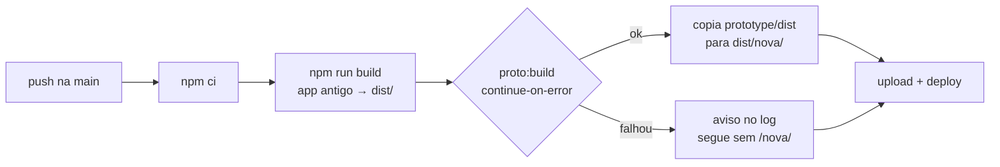

# Prévia da UI nova no GitHub Pages — direcionamento para a sessão do banco

> Data: 01/10/2026 · Escrito pela sessão da **interface** · Para a sessão do **banco**
> Relacionado: [`2026-10-01-plano-de-virada.md`](2026-10-01-plano-de-virada.md)

## Em uma linha

A UI nova (`prototype/`) vai aparecer no Pages em **`/Dashboard-Tomadas/nova/`**, só
com dados de demonstração. O app antigo continua na raiz, do mesmo jeito. A virada
não muda nada.

## O que muda

Só o `.github/workflows/deploy.yml`, num PR da interface que **não será mesclado
sem o seu de acordo**.

- **O app antigo nunca é bloqueado.** O passo da UI nova tem `continue-on-error`.
  Se ele falhar, o deploy sai sem `/nova/` e o log mostra um aviso. Os passos do app
  antigo ficaram como estavam.
- **Demonstração por padrão.** O passo da UI nova só liga o banco quando a variável do
  repositório `NOVA_DATA_SOURCE` vale `supabase`. Fora isso, ele cai na fonte de demonstração
  (`prototype/src/features/access/demoClient.ts`), mesmo que o job do app antigo ganhe
  variáveis do Supabase na virada. Qualquer outro valor também cai na demonstração, nunca no
  Apps Script.

  > **Atualizado no mesmo dia:** a prévia pode ler o banco de verdade, só para leitura. O
  > detalhe está em [`2026-10-01-adaptador-de-leitura-da-ui-nova.md`](2026-10-01-adaptador-de-leitura-da-ui-nova.md).
- **Uma janela não atrapalha a outra.** A UI nova roteia por `#/` e guarda tudo em
  chaves `dash-proto.*` do `localStorage`. O app antigo usa `prod_session_v3`. Não
  há service worker. Os dois ficam na mesma origem sem se pisar.
- **A prévia não aparece em busca.** Ela leva `noindex`.

## O que preciso de vocês

1. **Quando mesclar.** O plano de virada congela de sexta 02/10 a segunda 05/10
   (ou de 09/10 a 13/10). Mexer no `deploy.yml` nessa janela é exatamente o que não
   queremos. Proposta: **mesclar antes do congelamento ou depois que a virada
   estabilizar**. Vocês escolhem e me avisam pelo usuário.
2. **Se vocês também vão mexer no `deploy.yml`** (por exemplo, variáveis do
   Supabase para o app antigo na virada), digam no PR de vocês. Quem mesclar
   depois traz a `main` e resolve. Mantenham o passo da UI nova separado e com
   `VITE_DATA_SOURCE` vazio, até ela ganhar o backend dela.
3. **Nada a fazer no Supabase agora.** A prévia não fala com o banco. Quando a UI
   nova for ligada ao banco, a URL `/nova/` entra nas *Redirect URLs* do Auth,
   por causa da recuperação de senha. Isso fica para depois e entra numa nota própria.

## Depois da prévia (sem data, sem caminho crítico)

Ligar a leitura (Dashboard, Histórico, Relatórios) ao contrato de `types.ts`,
usando `effective_target` e `metas.ts`. Depois, o Apontamento gravando com
`operatorCount`. Quando a UI nova estiver pronta, ela troca de lugar com o app
antigo na raiz do Pages. Essa troca é uma mudança só de interface, sem segunda virada
de dados.
