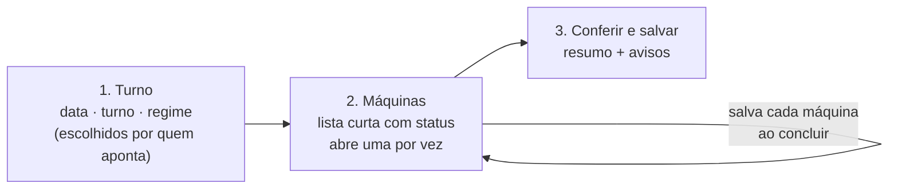

# Proposta: um Apontamento mais simples para o operador

> 08/10/2026 · Sessão da interface · **Proposta, nada disto está implementado.**
> Pedido do usuário no item 8 das decisões da auditoria
> ([relatório](auditoria-2026-10-07.md)).
>
> **Protótipo clicável:** [`prototipo-apontamento.html`](prototipo-apontamento.html)
> (abra no navegador; dados fictícios, nada é gravado).
>
> Revisão de 08/10: data, turno e regime ficam com quem aponta (sem
> preencher pelo relógio).

## Como é hoje

Uma página longa com as 22 máquinas abertas ao mesmo tempo, agrupadas por
linha. Cada máquina tem a coluna da esquerda (nome, etiquetas, o que já foi
gravado, barra de meta, OP liberada, nº de operadores) e a da direita (OPs,
quantidade, retrabalho, observação). No topo: data, turno, regime e filtro. Um
único "Salvar apontamento" grava tudo.

O que pesa para quem aponta no fim do turno:

1. **Muita coisa na tela de uma vez.** O operador cuida de 2 ou 3 máquinas e
   rola por 22.
2. **Digitar o que o sistema já sabe.** A OP liberada aparece na esquerda, mas
   precisa ser escolhida de novo no campo da direita.
3. **Um salvar só para tudo.** Se a conexão cai ou a pessoa sai da tela, perde o
   que digitou nas outras máquinas.
4. **Máquina parada não tem como ser dita.** "13 de 22" não diferencia quem
   esqueceu de quem não produziu.
5. **Erro de digitação passa.** Um zero a mais (40.000 em vez de 4.000) é
   gravado sem aviso.

## A proposta: três passos

### 1. Turno — quem aponta escolhe

- Data, turno e regime **começam vazios** e são escolhidos por quem aponta. A
  tela não adivinha: sem os três, não passa para as máquinas.
- Trocar o turno depois pede confirmação, porque a lista recomeça para o
  turno novo.
- Ao abrir, a tela lembra as **máquinas da última vez** dessa pessoa e as mostra
  primeiro ("Suas máquinas"). As outras continuam a um toque ("Todas as
  máquinas").

### 2. Máquinas — uma lista curta, uma máquina por vez

Cada máquina vira **uma linha** com o status, em vez de um cartão aberto:

| Máquina | Status |
|---|---|
| Composé nº 1 | ✔ 4.000 un. · OP 4510204 |
| Composé (Aumaq) | Pendente |
| Bancada nº 5 | Parada: manutenção |

Ao tocar, abre só aquela máquina (no celular, em tela cheia; no computador, ao
lado da lista), com:

- **OP liberada já escolhida.** Se houver mais de uma, as liberadas vêm no topo
  da lista. "Outra OP" continua possível.
- **Quantidade** em campo grande, com a meta do turno embaixo ("meta 4.000").
- **Retrabalho** como já está agora: ao marcar, a caixa pergunta o motivo
  (feito neste PR).
- **Nº de operadores** só quando muda a meta (feito neste PR).
- Observação recolhida em "Adicionar observação".
- Botão **"Concluir máquina"**: grava essa máquina e volta para a lista, com a
  próxima pendente destacada. Nada se perde se a pessoa sair no meio.
- Botão **"Não produziu"** com motivos rápidos (parada, manutenção, sem OP, sem
  operador). A máquina sai de "pendente" e o "13 de 22" passa a contar só quem
  realmente falta.

### 3. Conferir e salvar

Um resumo antes de terminar o turno: quantas máquinas apontadas, quantas
paradas, quantas faltam, total de peças, e **avisos de conferência**:

- quantidade acima de 2× a meta do turno ("Confere 40.000? A meta é 4.000");
- mesma OP em duas máquinas;
- máquina com produção e nº de operadores vazio, quando ele muda a meta.

Os avisos não bloqueiam: "Está certo" segue em frente.

## O que muda para quem não é operador

Nada na navegação: continua sendo a aba Apontamento. O gestor que corrige um
dia antigo usa os mesmos passos (escolhe a data no passo 1). O Histórico segue
sendo o lugar de corrigir apontamentos já gravados.

## Em que ordem fazer

| Etapa | O que entra | Depende do banco? |
|---|---|---|
| A | OP liberada pré-escolhida, aviso de quantidade acima de 2× a meta | Não |
| B | Lista curta com status + uma máquina por vez + "Concluir máquina" (grava por máquina) | Não: o `saveEntries` aceita uma lista com uma máquina só. Como ele acrescenta (D30), reabrir uma máquina concluída mostra o que já foi gravado, como hoje |
| C | "Suas máquinas" (lembrar as máquinas de cada pessoa) | Não no começo (fica no navegador); depois, de preferência no perfil do usuário |
| D | "Não produziu" com motivo | **Sim**: precisa de um lugar para gravar máquina parada e o motivo. Proposta vai como recado ao banco quando a etapa for aprovada |

Recomendo começar pela **A** (pequena, sem risco) e testar a **B** com um
operador de verdade, num celular, antes de trocar a tela de vez.
