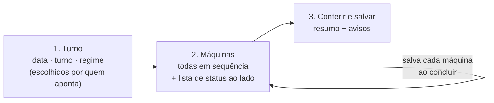

# Proposta: um Apontamento mais simples para o distribuidor

> 08/10/2026 · Sessão da interface · **Proposta, nada disto está implementado.**
> Pedido do usuário no item 8 das decisões da auditoria
> ([relatório](auditoria-2026-10-07.md)).
>
> **Protótipo clicável:** [`prototipo-apontamento.html`](prototipo-apontamento.html)
> (abra no navegador; dados fictícios, nada é gravado).
>
> Revisão de 08/10: data, turno e regime ficam com quem aponta (sem
> preencher pelo relógio).

## Como é hoje

Uma página longa com as 22 máquinas abertas ao mesmo tempo, agrupadas por
linha. Cada máquina tem a coluna da esquerda (nome, etiquetas, o que já foi
gravado, barra de meta, OP liberada, nº de operadores) e a da direita (OPs,
quantidade, retrabalho, observação). No topo: data, turno, regime e filtro. Um
único "Salvar apontamento" grava tudo.

O que pesa para quem aponta no fim do turno:

1. **Muita coisa na tela de uma vez.** Quem aponta é o distribuidor, que
   responde pelas 22 máquinas: todas abertas ao mesmo tempo, num cartão alto
   cada, tornam difícil saber o que já foi feito e o que falta.
2. **Digitar o que o sistema já sabe.** A OP liberada aparece na esquerda, mas
   precisa ser escolhida de novo no campo da direita.
3. **Um salvar só para tudo.** Se a conexão cai ou a pessoa sai da tela, perde o
   que digitou nas outras máquinas.
4. **Máquina parada não tem como ser dita.** "13 de 22" não diferencia quem
   esqueceu de quem não produziu.
5. **Erro de digitação passa.** Um zero a mais (40.000 em vez de 4.000) é
   gravado sem aviso.

## A proposta: três passos

### 1. Turno — quem aponta escolhe

- Data, turno e regime **começam vazios** e são escolhidos por quem aponta. A
  tela não adivinha: sem os três, não passa para as máquinas.
- Trocar o turno depois pede confirmação, porque a lista recomeça para o
  turno novo.
- Só os nomes: "Turno 1/2/3" e "Normal/Hora extra", sem horários nem
  explicações embaixo (pedido de 08/10/2026).

### 2. Máquinas — todas em sequência, cada uma com "Concluir"

> Revisto em 08/10/2026. A primeira versão abria uma máquina por vez, pensando
> num operador com 2 ou 3 máquinas. Quem aponta é o **distribuidor**, que
> responde pelas 22: para ele, abrir e fechar uma tela por máquina seria mais
> lento que a página de hoje. A versão nova mantém todas as máquinas na página.

- **Lista de status fixa ao lado** (no celular, uma barra fixa no topo com
  "7 de 22 concluídas" e "Próxima pendente"). Cada máquina aparece com uma
  bolinha: vazia = pendente, verde = apontada, cinza = não produziu. A próxima
  pendente fica destacada. Clicar leva até a máquina.
- **Todas as máquinas em sequência, por linha**, como hoje: Nº da OP (começa
  vazio), quantidade, retrabalho com o campo do motivo, nº de pessoas só onde
  muda a meta, observação recolhida.
- **"Concluir" em cada máquina:** grava aquela máquina na hora, recolhe o
  cartão numa linha de resumo ("3.900 peças · OP 4510204", com "Editar") e
  leva o cursor ao Nº da OP da próxima pendente. **Enter na quantidade também
  conclui**, para quem digita em sequência. Nada se perde se a pessoa sair no
  meio.
- **"Não produziu"** com motivos rápidos (parada, manutenção, sem OP, sem
  operador, setup). A máquina sai de "pendente" e o contador passa a contar só
  quem realmente falta (depende do banco: etapa D).
- O aviso de quantidade acima de 2× a meta continua no cartão, com "Está
  certo" (etapa A, já no app).

### 3. Conferir e salvar

Um resumo antes de terminar o turno: quantas máquinas apontadas, quantas
paradas, quantas faltam, total de peças, e **avisos de conferência**:

- quantidade acima de 2× a meta do turno ("Confere 40.000? A meta é 4.000");
- mesma OP em duas máquinas;
- máquina com produção e nº de operadores vazio, quando ele muda a meta.

Os avisos não bloqueiam: "Está certo" segue em frente.

## O que muda para quem não é operador

Nada na navegação: continua sendo a aba Apontamento. O gestor que corrige um
dia antigo usa os mesmos passos (escolhe a data no passo 1). O Histórico segue
sendo o lugar de corrigir apontamentos já gravados.

## Em que ordem fazer

| Etapa | O que entra | Depende do banco? |
|---|---|---|
| A | Aviso de quantidade acima de 2× a meta, com pergunta ao salvar. **Feito** (`d0c548b`, `44c9608`). A OP liberada pré-escolhida ficou de fora por decisão do usuário: o nº da OP começa vazio | Não |
| B | Lista de status fixa ao lado + "Concluir" em cada máquina (grava por máquina, recolhe o cartão e leva à próxima pendente); todas as máquinas continuam na página | Não: o `saveEntries` aceita uma lista com uma máquina só. Como ele acrescenta (D30), reabrir uma máquina concluída mostra o que já foi gravado, como hoje |
| ~~C~~ | ~~"Suas máquinas"~~. **Retirada em 08/10/2026:** quem aponta é o distribuidor, responsável por todas as máquinas, então não há "máquinas de cada pessoa" | — |
| D | "Não produziu" com motivo | **Sim**: precisa de um lugar para gravar máquina parada e o motivo. Proposta vai como recado ao banco quando a etapa for aprovada |

A **A** já está no app. Recomendo testar a **B** com o distribuidor, no
aparelho que ele usa no fim do turno, antes de trocar a tela de vez.
